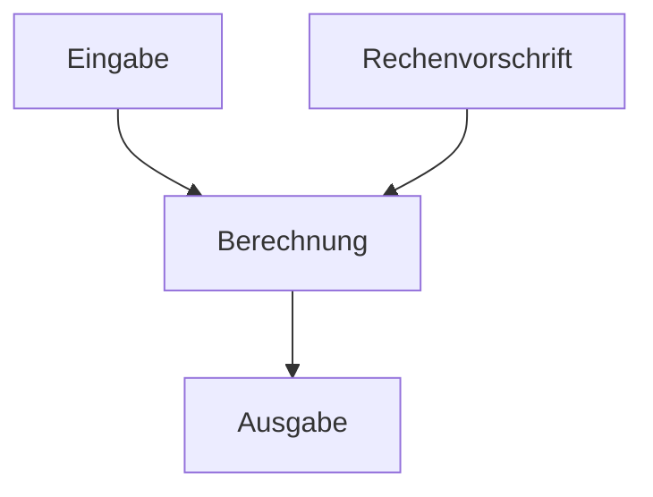

# Algorithmus
= nach Brockhaus ist ein Algorithmus ein Rechenverfahren, welches in genau festgelegten Schritten vorgeht.

# Suchalgorithmen
Datensätze enthalten Schlüssel nach welchen diese Datensätze zu durchsuchen sind. <br>
Es gibt **einfache** und **heuristische** Suchverfahren. <br>
**Heuristishe Suchverfahren** beziehen wissen über den Suchraum (z.B. Datenverteilung) mit ein. <br>
Gesucht wird üblicherweise mit folgenden Datensturkturen:
- Listen
- Bäume
- Graphen

## Suchverfahren
**Elementares Suchverfahren**: Werte werden miteinander verglichen, um einen gesuchten Wert zu finden. <br>
Beispiel:
```text
[3,5,8,12,20]

Gesucht: 8

ist 3 die 8 -> Nein 
ist 5 die 8 -> Nein 
ist 8 die 8 -> Ja -> Gefunden
```
**Suchverfahren mit arithmetischen Operationen**: Hashing <br>
Aus dem gesuchten Schlüssel wird mit einer Berechnung bestimmt, an welcher Speicherstelle der Wert ungefähr bzw. direkt liegen sollte. <br>
Beispiel:
```text
Schlüssel / gesuchter Wert: 42
Tabellengröße: 10

Hashfunktion:
42 % 10 = 2

-> Der Wert wird an Position 2 gesucht.
```
**Baumstrukturen**<br>
Siehe: [Baumstrukturen](Graphentheorie.md)
# Sequentielle Suche
### unsortierter Datenbestand
Gesamte Daten werden von vorne (oder hinten) durchlaufen bis ein Element gefunden wurde.


### sortierter Datenbestand
Suche wird optimiert indem sie abbricht, sobald man das Element gefunden hat.


