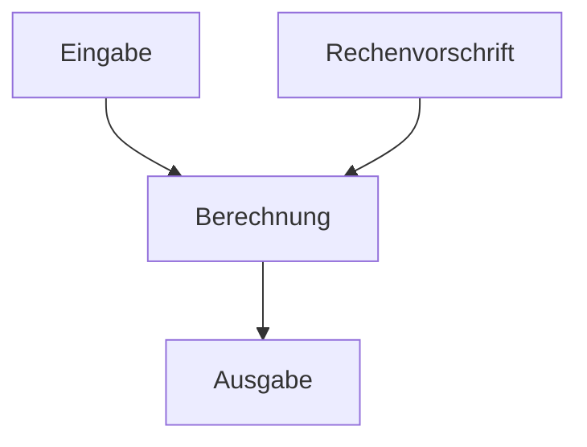
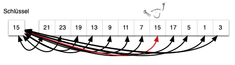
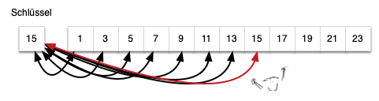

# Algorithmus
= nach Brockhaus ist ein Algorithmus ein Rechenverfahren, welches in genau festgelegten Schritten vorgeht.

# Suchalgorithmen
Datensätze enthalten Schlüssel nach welchen diese Datensätze zu durchsuchen sind. <br>
Es gibt **einfache** und **heuristische** Suchverfahren. <br>
**Heuristishe Suchverfahren** beziehen wissen über den Suchraum (z.B. Datenverteilung) mit ein. <br>
Gesucht wird üblicherweise mit folgenden Datensturkturen:
- Listen
- Bäume
- Graphen

## Suchverfahren
**Elementares Suchverfahren**: Werte werden miteinander verglichen, um einen gesuchten Wert zu finden. <br>
Beispiel:
```text
[3,5,8,12,20]

Gesucht: 8

ist 3 die 8 -> Nein 
ist 5 die 8 -> Nein 
ist 8 die 8 -> Ja -> Gefunden
```
**Suchverfahren mit arithmetischen Operationen**: Hashing <br>
Aus dem gesuchten Schlüssel wird mit einer Berechnung bestimmt, an welcher Speicherstelle der Wert ungefähr bzw. direkt liegen sollte. <br>
Beispiel:
```text
Schlüssel / gesuchter Wert: 42
Tabellengröße: 10

Hashfunktion:
42 % 10 = 2

-> Der Wert wird an Position 2 gesucht.
```
**Baumstrukturen**<br>
Siehe: [Baumstrukturen](Graphentheorie.md)
# Sequentielle Suche
### unsortierter Datenbestand
Die Elemente werden der Reihe nach durchsucht, bis der gesuchte Wert gefunden wurde oder das Ende des Datenbestands erreicht ist.<br>
Da die Daten **nicht sortiert** sind, weiß man nicht, wo sich der gesuchte Wert befindet.


Code Beispiel:
```java
int[] numbers = {8, 3, 12, 5, 7};

public static int seqSearchUnsorted(int[] numbers, int target){
    for (int i = 0; i < numbers.length; i++){
        if (numbers[i] == target){
            return i;
        }
    }
    return -1;
}

```

### sortierter Datenbestand
Auch hier werden die Elemente der Reihe nach durchsucht.<br>
Da die Daten jedoch **sortiert** sind, kann die Suche früher abgebrochen werden:

- wenn der Wert gefunden wurde
- oder wenn der aktuelle Wert bereits **größer als der gesuchte Wert** ist

Dann kann der gesuchte Wert später nicht mehr vorkommen.


Code Beispiel:
```java
int[] numbers = {3, 5, 8, 12, 20};

public static int seqSearchSorted(int[] numbers, int target){
    for (int i = 0; i < numbers.length; i++){
        if (number[i] == target){
            return i;
        }
        if(number [i] > target){
            return -1;
        }
    }
    return -1;
}
```
# Binäre Suche
**Voraussetzung:** Die Elemente müssen **sortiert** sein.

Bei der binären Suche wird immer das **mittlere Element** des aktuellen Suchbereichs betrachtet.<br>
Dann wird geprüft:

- Ist der gesuchte Wert gleich dem mittleren Wert?  
  → Wert gefunden.

- Ist der gesuchte Wert kleiner als der mittlere Wert?  
  → Nur die **linke Hälfte** wird weiter durchsucht.

- Ist der gesuchte Wert größer als der mittlere Wert?  
  → Nur die **rechte Hälfte** wird weiter durchsucht.

Dadurch wird der Suchbereich bei jedem Schritt ungefähr halbiert.

Das wird so lange wiederholt, bis das Element gefunden wurde oder kein Suchbereich mehr übrig ist.

Code Beispiel:
```java
int[] numbers = {
    1, 2, 4, 6, 7, 8, 9, 11, 12, 13, 15,
    16, 17, 19, 20, 23, 24, 25, 26, 27, 29, 30
};

public static int binarySearch(int[] numbers, int target) {

    int left = 0;
    int right = numbers.length - 1;

    while (left <= right) {
        int middle = left + (right - left) / 2;

        if (numbers[middle] == target) {
            return middle;
        }

        if (target < numbers[middle]) {
            right = middle - 1;
        } else {
            left = middle + 1;
        }
    }

    return -1;
}
```

# Exponentielle Suche

Wird verwendet, wenn die Größe des Suchbereichs nicht bekannt oder sehr groß ist.

Zuerst wird eine obere Grenze für den Suchbereich gesucht.<br>
Dafür werden die Indizes exponentiell vergrößert:<br>
1 → 2 → 4 → 8 → 16 → ...<br>
Sobald ein Wert gefunden wird, der größer oder gleich dem gesuchten Wert ist,
ist der mögliche Suchbereich bekannt.<br>
Anschließend wird in diesem Bereich z.B. eine binäre Suche durchgeführt.<br>

Code Beispiel:
```java
public static int exponentialSearch(int[] numbers, int target) {

    if (numbers.length == 0) {
        return -1;
    }

    if (numbers[0] == target) {
        return 0;
    }

    int index = 1;

    // Suchbereich exponentiell vergrößern
    while (index < numbers.length && numbers[index] < target) {
        index = index * 2;
    }

    // Grenzen für die binäre Suche bestimmen
    int left = index / 2;
    int right = Math.min(index, numbers.length - 1);

    // Binäre Suche im gefundenen Bereich
    .
    .
    .
}
```
# Interpolationssuche
Variation der binären Suche.<br>
Voraussetzung:
Die Daten müssen sortiert sein.

Bei der binären Suche wird immer das mittlere Element des
Suchbereichs betrachtet.<br>
Bei der Interpolationssuche wird stattdessen geschätzt,
an welcher Position der gesuchte Wert ungefähr liegen müsste.

Beispiel:
In einem Telefonbuch würde man bei "Bayer" eher vorne
und bei "Zimmermann" eher hinten suchen.

Je näher der Suchwert am größten Wert liegt,
desto weiter hinten wird gesucht.

Code Bespiel:
```java
public static int interpolationSearch(int[] numbers, int target) {

    int left = 0;
    int right = numbers.length - 1;

    while (
        left <= right &&
        target >= numbers[left] &&
        target <= numbers[right]
    ) {

        if (numbers[left] == numbers[right]) {
            if (numbers[left] == target) {
                return left;
            }
            return -1;
        }

        int position = left
                + (target - numbers[left])
                * (right - left)
                / (numbers[right] - numbers[left]);

        if (numbers[position] == target) {
            return position;
        }

        if (numbers[position] < target) {
            left = position + 1;
        } else {
            right = position - 1;
        }
    }

    return -1;
}
```
# Indexsuche
Bei der Indexsuche wird nicht der gesamte Datenbestand durchsucht. <br>
Stattdessen gibt es einen **Index**, in dem gespeichert ist, wo bestimmte Daten zu finden sind. <br>
Man kann sich das ähnlich wie das Inhaltsverzeichnis oder Register in einem Buch vorstellen.
### Prinzip:

Zuerst wird ein Index aufgebaut: <br>
Schlüssel → Speicherort

Beispiel:

Müller → Position 120 <br>
Schmidt → Position 450 <br>
Zimmermann → Position 980 <br>

Wenn nach Schmidt gesucht wird, muss nicht die komplette Datenmenge durchsucht werden.
Stattdessen wird zuerst im Index nachgesehen:
Schmidt → Position 450

Danach kann direkt auf die entsprechende Stelle zugegriffen werden.
### Ablauf
1. Index erstellen
2. Suchbegriff im Index suchen
3. Speicherort bestimmen
4. Daten an dieser Stelle ausgeben

### Vorteil
Die Suche ist besonders bei großen Datenmengen deutlich schneller.
### Nachteil
Der Index benötigt zusätzlichen Speicher und muss aktualisiert werden,
wenn Daten hinzugefügt, geändert oder gelöscht werden.

Code Beispiel: 
```java
import java.util.HashMap;
import java.util.Map;

public class IndexSearchExample {

    public static void main(String[] args) {

        Map<String, Integer> index = new HashMap<>();

        index.put("Müller", 120);
        index.put("Schmidt", 450);
        index.put("Zimmermann", 980);

        String target = "Schmidt";

        if (index.containsKey(target)) {
            int position = index.get(target);

            System.out.println("Gefunden an Position: " + position);
        } else {
            System.out.println("Nicht gefunden");
        }
    }
}
```


